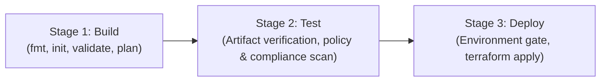

# Azure Infrastructure with Multi-Stage Azure DevOps CI/CD Pipeline

Production-ready Infrastructure as Code (IaC) repository using **Terraform** in a **Parent-Child Modular Architecture** and an automated **Azure DevOps Multi-Stage CI/CD Pipeline** (`azure-pipelines.yml`).

---

## 🏛 Architecture & Infrastructure Components

```
                        ┌─────────────────────────────────────────────────────────┐
                        │                   Azure Resource Group                  │
                        │                                                         │
                        │  ┌───────────────────────────────────────────────────┐  │
                        │  │                 Virtual Network                   │  │
                        │  │                                                   │  │
                        │  │  ┌─────────────────────────────────────────────┐  │  │
                        │  │  │                   Subnet                    │  │  │
                        │  │  │                                             │  │  │
                        │  │  │  ┌──────────────┐      ┌─────────────────┐  │  │  │
                        │  │  │  │   Linux VM   │      │   NAT Gateway   │  │  │  │
                        │  │  │  │  (Ubuntu 22) │      │ (Outbound Only) │  │  │  │
                        │  │  │  └──────┬───────┘      └────────┬────────┘  │  │  │
                        │  │  └─────────┼───────────────────────┼───────────┘  │  │
                        │  └────────────┼───────────────────────┼──────────────┘  │
                        │               │                       │                 │
                        │        ┌──────┴──────┐         ┌──────┴──────┐          │
                        │        │  VM Pub IP  │         │ NAT Pub IP  │          │
                        │        │(Direct SSH) │         │  (Outbound) │          │
                        │        └─────────────┘         └─────────────┘          │
                        │                                                         │
                        │  ┌───────────────────────────────────────────────────┐  │
                        │  │       Storage Account (HTTPS / TLS 1.2 Only)      │  │
                        │  └───────────────────────────────────────────────────┘  │
                        └─────────────────────────────────────────────────────────┘
```

The infrastructure provisions the following resources:
- **Resource Group**: Central management scope for all resources.
- **Virtual Network & Subnet**: Isolated address space (`10.0.0.0/16`) and workload subnet (`10.0.1.0/24`).
- **NAT Gateway & NAT Public IP**: Standard SKU NAT Gateway attached to the subnet for outbound internet access.
- **Linux Virtual Machine**:
  - Ubuntu 22.04 LTS Jammy.
  - Password authentication enabled (`disable_password_authentication = false`).
  - Network Interface Card (NIC) with private IP.
  - Dedicated VM Public IP for direct SSH access.
  - Network Security Group (NSG) with inbound rule for SSH (Port 22).
- **Storage Account**: General Purpose v2 storage account with TLS 1.2 minimum and HTTPS enforcement.

---

## 📂 Project Directory Structure

```
Infra_project-ADO/
├── .gitignore
├── README.md
├── azure-pipelines.yml                    # Azure DevOps Multi-Stage CI/CD Pipeline
└── terraform/
    ├── main.tf                            # Parent (Root) module orchestrating child modules
    ├── backend.tf                         # Dedicated remote backend configuration (Azure Blob Storage)
    ├── variables.tf                       # Root input variable declarations
    ├── outputs.tf                         # Aggregated outputs (VM IP, NAT IP, SSH command)
    ├── providers.tf                       # AzureRM & Random provider configuration
    ├── terraform.tfvars.example           # Example local variable values
    ├── environments/
    │   └── dev.tfvars                     # Dev environment configurations
    └── modules/
        ├── network/                       # Child Module: VNet, Subnet, NAT Gateway, NAT Public IP
        │   ├── main.tf
        │   ├── variables.tf
        │   └── outputs.tf
        ├── compute/                       # Child Module: Linux VM, NSG, NIC, VM Public IP
        │   ├── main.tf
        │   ├── variables.tf
        │   └── outputs.tf
        └── storage/                       # Child Module: Azure Storage Account
            ├── main.tf
            ├── variables.tf
            └── outputs.tf
```

---

## 🚀 Azure DevOps CI/CD Workflow

The pipeline (`azure-pipelines.yml`) follows a 3-stage promotion flow:



1. **Stage 1: Build (`Terraform_Build`)**
   - Installs Terraform CLI.
   - Runs `terraform fmt -check` to ensure style consistency.
   - Runs `terraform init` and `terraform validate` to verify syntax.
   - Compiles execution plan with environment variables: `terraform plan -out=tfplan`.
   - Publishes `tfplan` and Terraform files as a pipeline artifact.

2. **Stage 2: Test (`Terraform_Test`)**
   - Downloads the compiled build artifact.
   - Inspects plan structure and outputs a human-readable plan summary.
   - Runs policy and security tests (verifying HTTPS enforcement, TLS 1.2, SSH rules, and modular invocation).
   - Publishes plan summary artifact for audit trail.

3. **Stage 3: Deploy (`Terraform_Deploy`)**
   - Linked to Azure DevOps Environment (`infra-dev`), supporting approval gates and audit logs.
   - Executes `terraform apply` using the validated `tfplan`.
   - Prints connection details and public IPs to the deployment log.

### Destroy Pipeline (`destroy-pipeline.yml`)
A dedicated pipeline is provided to safely tear down all provisioned resources on demand:
- **No Automatic Triggers**: `trigger: none` and `pr: none` to prevent accidental executions.
- **Parameters**: Select target environment (`dev`, `staging`, `prod`) and confirm teardown by typing `DESTROY`.
- **Stage 1 (Plan Destroy)**: Generates a destroy execution plan (`terraform plan -destroy`) and displays a preview of resources to be deleted.
- **Stage 2 (Execute Teardown)**: Uses Azure DevOps Environment gates and applies the compiled destroy plan to cleanly tear down infrastructure.

---

## 🔑 Authentication Setup (Client ID & Client Secret)

### 1. Create Azure Service Principal
Run the following Azure CLI command to create a Service Principal with `Contributor` role on your subscription:

```bash
# Get your Subscription ID
SUBSCRIPTION_ID=$(az account show --query id -o tsv)

# Create Service Principal
az ad sp create-for-rbac \
  --name "sp-ado-terraform" \
  --role "Contributor" \
  --scopes "/subscriptions/${SUBSCRIPTION_ID}"
```

This returns JSON output:
```json
{
  "appId": "00000000-0000-0000-0000-000000000000",
  "displayName": "sp-ado-terraform",
  "password": "xxxxxxxx-xxxx-xxxx-xxxx-xxxxxxxxxxxx",
  "tenant": "00000000-0000-0000-0000-000000000000"
}
```

### 2. Configure Azure DevOps Variable Group
1. In Azure DevOps, navigate to **Pipelines** > **Library**.
2. Click **+ Variable group** and name it: `azure-sp-credentials`.
3. Add the following variables:

| Variable Name | Value | Secret (Lock icon) |
|---|---|:---:|
| `ARM_CLIENT_ID` | Value of `appId` | No |
| `ARM_CLIENT_SECRET` | Value of `password` | **Yes (Lock)** |
| `ARM_TENANT_ID` | Value of `tenant` | No |
| `ARM_SUBSCRIPTION_ID` | Your Azure Subscription ID | No |
| `TF_VAR_admin_password` | Complex password for Linux VM | **Yes (Lock)** |

4. Under **Pipeline permissions**, grant access to your pipeline.

---

## ☁️ Remote State Backend Setup (Manual Prerequisite Before Pipeline)

Before triggering the Azure DevOps pipeline, the remote backend storage account and container **must be created manually** in Azure to store Terraform state (`.tfstate`):

1. **Create the Backend Resources Manually via Azure CLI or Azure Portal**:
   ```bash
   # Create Resource Group for state management
   az group create --name rg-tfstate-mgmt --location eastus

   # Create globally unique Storage Account for state files
   az storage account create \
     --name sttfstatemgmt1209 \
     --resource-group rg-tfstate-mgmt \
     --location eastus \
     --sku Standard_LRS \
     --min-tls-version TLS1_2 \
     --allow-blob-public-access false

   # Create blob container for terraform state
   az storage container create \
     --name tfstate \
     --account-name sttfstatemgmt1209 \
     --auth-mode login
   ```

2. **Verify [backend.tf](file:///d:/DevopsInsider/CICD/Infra_project-ADO/terraform/backend.tf)**:
   Ensure your `backend.tf` matches your manually created resources:
   ```hcl
   terraform {
     backend "azurerm" {
       resource_group_name  = "rg-tfstate-mgmt"
       storage_account_name = "sttfstatemgmt1209"
       container_name       = "tfstate"
       key                  = "infra-project.tfstate"
     }
   }
   ```
   > **Important**: In the Azure DevOps pipeline, `terraform init` will authenticate directly to this storage account using your Service Principal credentials (`ARM_CLIENT_ID` and `ARM_CLIENT_SECRET`). For local syntax testing without connecting to Azure, use `terraform init -backend=false`.

---

## 💻 Local Testing Guide

To test or run locally from your workstation:

```bash
cd terraform

# 1. Initialize provider plugins and child modules
terraform init

# 2. Check code formatting
terraform fmt -check -recursive

# 3. Validate syntax
terraform validate

# 4. Plan with local variables
terraform plan -var-file="environments/dev.tfvars"

# 5. Apply changes (creates resources)
terraform apply -var-file="environments/dev.tfvars"

# 6. Destroy infrastructure when no longer needed
terraform destroy -var-file="environments/dev.tfvars"
```

---

## 🖥 Connecting to the Linux VM

Once deployed, retrieve the outputs:
```bash
terraform output
```

Connect via SSH using the configured password:
```bash
ssh azureuser@<VM_PUBLIC_IP>
```
Enter the `admin_password` when prompted.
